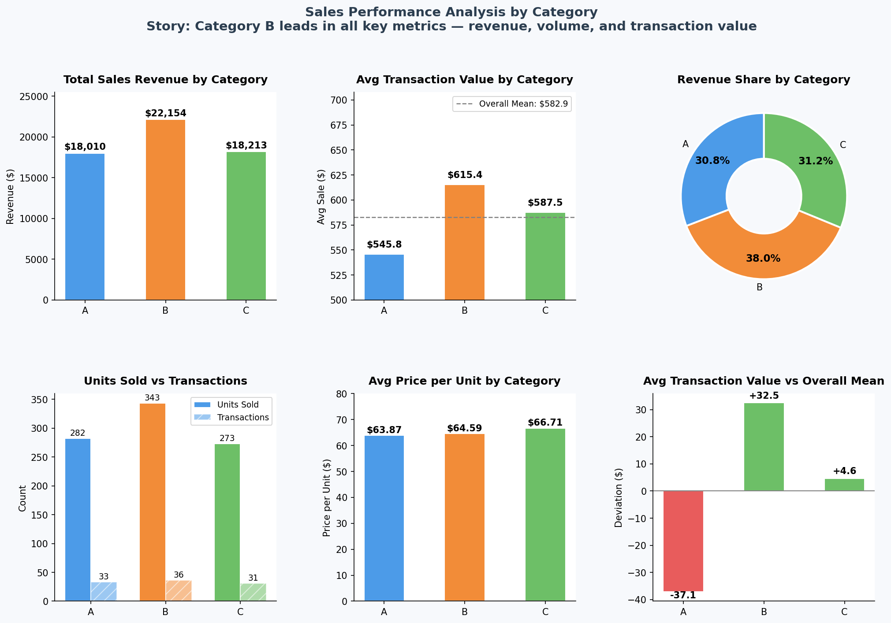

# W1A1 – Sales Category Analysis Using Data Aggregation

## Description

This assignment loads a pre-aggregated sales dataset (`Data_set_w1A1.xlsx`) containing three product categories (**A**, **B**, and **C**) and uncovers the story behind the numbers using **data aggregation techniques only** — no raw transactional data is required.

### Dataset (`descriptive_aggregation` sheet)

| Column | Description |
|---|---|
| `category` | Product category (A / B / C) |
| `sales_sum` | Total revenue per category |
| `sales_mean` | Average sale value per transaction |
| `sales_count` | Number of transactions |
| `quantity_sum` | Total units sold |
| `quantity_mean` | Average units per transaction |

### Aggregation Techniques Applied

- **Sum / Mean / Count** — direct from the dataset
- **Share (%)** — each category's proportion of total revenue, units, and transactions
- **Derived metric** — average price per unit (`sales_sum / quantity_sum`)
- **Deviation from mean** — how each category's average transaction value compares to the overall mean

---

## The Story Behind the Data

> **Category B is the clear performance leader across every key metric.**

| Metric | A | B | C |
|---|---|---|---|
| Total Revenue | $18,010 | **$22,154** | $18,213 |
| Revenue Share | 30.8% | **38.0%** | 31.2% |
| Avg Transaction | $545.8 | **$615.4** | $587.5 |
| Units Sold | 282 | **343** | 273 |
| Avg Price/Unit | $63.87 | $64.59 | **$66.71** |
| Transactions | 33 | **36** | 31 |

**Key insights:**
1. **Category B dominates** in total revenue (38% share), transaction volume (36 transactions), units sold (343), and average transaction value ($615.4 — $32.5 above the overall mean).
2. **Category A underperforms** — its average transaction value ($545.8) sits $37.1 *below* the overall mean, suggesting either lower-priced products or less effective upselling.
3. **Category C has the highest unit price** ($66.71/unit) but trails in both volume and transaction count, indicating a premium-but-niche positioning.
4. **Overall business**: 100 transactions, 898 units sold, $58,377 total revenue across all categories.

The data tells a story of **three distinct market segments**: a high-volume leader (B), a value-driven laggard (A), and a premium niche player (C).

---

## How to Run

```bash
pip install pandas matplotlib openpyxl
python analysis.py
```

The script prints the aggregated table with derived metrics to the console and saves `analysis_output.png`.

---

## Final Output


