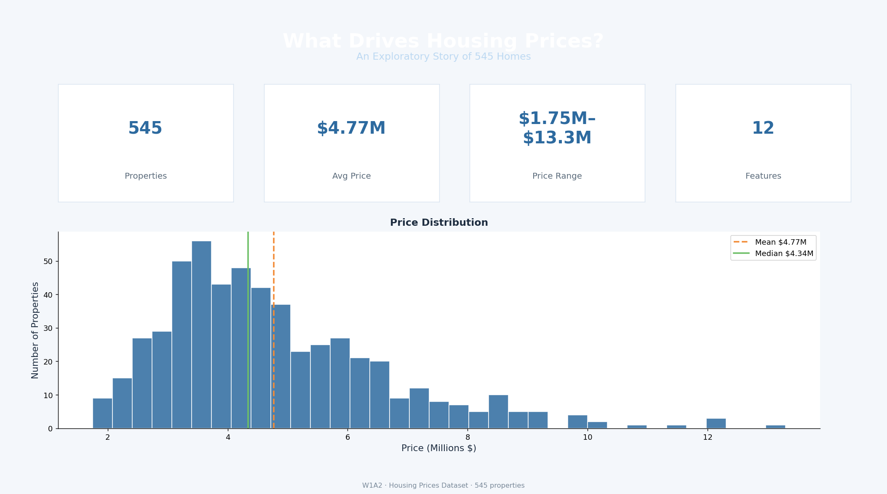
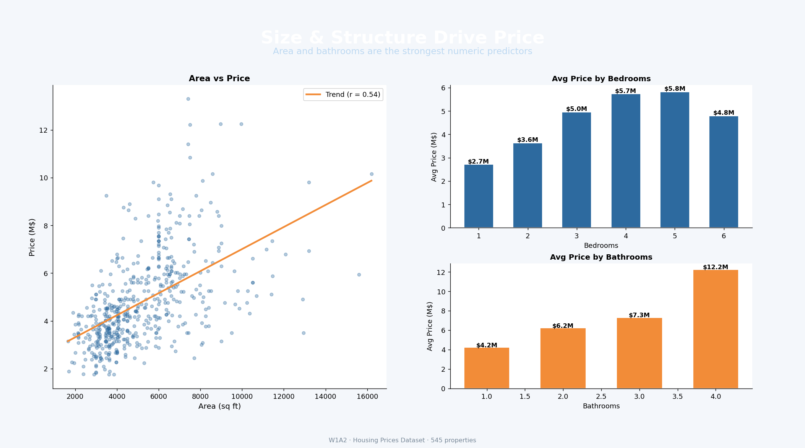
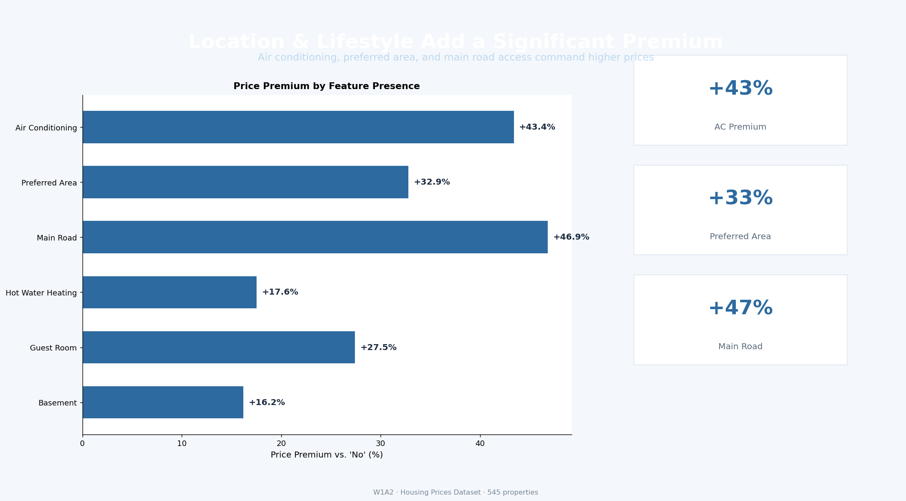
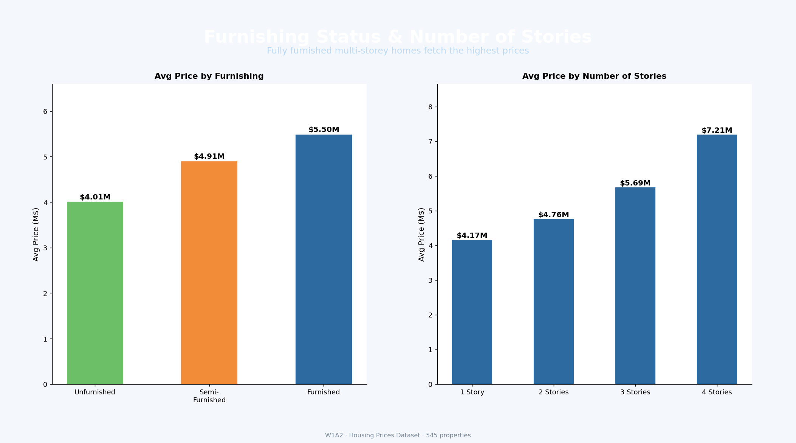
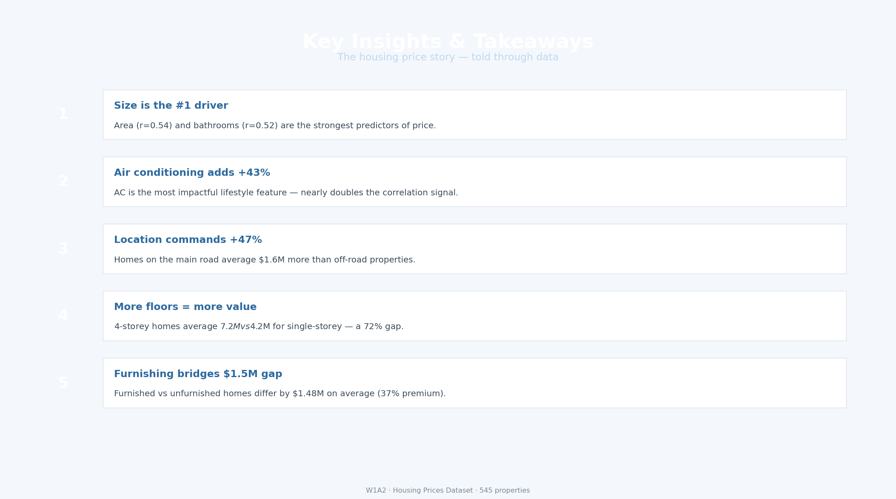

# W1A2 – Housing Prices: Initial Story in 5 Slides

## The Story

> **"Not all homes are equal — size, location, and lifestyle features can swing a price by millions."**

This dataset covers **545 residential properties** with 12 features spanning physical attributes (area, bedrooms, bathrooms, stories) and lifestyle amenities (AC, furnishing, preferred area, parking). The goal is to identify what truly drives housing prices using exploratory aggregation.

---

## Dataset Overview

| Feature | Type | Values |
|---|---|---|
| `price` | Numeric | $1.75M – $13.3M |
| `area` | Numeric | 1,650 – 16,200 sq ft |
| `bedrooms` | Numeric | 1 – 6 |
| `bathrooms` | Numeric | 1 – 4 |
| `stories` | Numeric | 1 – 4 |
| `airconditioning` | Binary | yes / no |
| `furnishingstatus` | Categorical | furnished / semi / unfurnished |
| `prefarea` | Binary | yes / no |
| `mainroad` | Binary | yes / no |
| `guestroom`, `basement`, `hotwaterheating` | Binary | yes / no |

---

## Analysis & Insights

### 1 · Price Distribution
The price distribution is **right-skewed** — most homes cluster between $3M–$6M, with a long tail of premium properties above $10M. Mean ($4.77M) sits above median ($4.34M), confirming the skew.

### 2 · Top Numeric Predictors (Correlation with Price)

| Feature | Correlation (r) |
|---|---|
| Area | **0.54** |
| Bathrooms | **0.52** |
| Stories | 0.42 |
| Parking | 0.38 |
| Bedrooms | 0.37 |

Area and bathrooms are the strongest drivers — a larger, better-equipped home commands a higher price.

### 3 · Lifestyle Feature Premiums

| Feature | With Feature | Without | Premium |
|---|---|---|---|
| Air Conditioning | $6.01M | $4.19M | **+43%** |
| Main Road Access | $4.99M | $3.40M | **+47%** |
| Preferred Area | $5.88M | $4.43M | **+33%** |
| Guest Room | $5.44M | $4.55M | +20% |
| Basement | $5.04M | $4.34M | +16% |

**Air conditioning and location are the two most decisive binary features.**

### 4 · Furnishing & Stories

| Furnishing | Avg Price |
|---|---|
| Unfurnished | $4.01M |
| Semi-Furnished | $4.91M |
| Furnished | **$5.50M** |

| Stories | Avg Price |
|---|---|
| 1 | $4.17M |
| 2 | $4.76M |
| 3 | $5.69M |
| 4 | **$7.21M** |

A fully furnished 4-storey home in a preferred area with AC represents the top of the market.

### 5 · Key Takeaways

| # | Insight |
|---|---|
| 1 | **Size first** — area (r=0.54) is the single strongest predictor |
| 2 | **AC adds +43%** — the most impactful binary feature |
| 3 | **Location matters** — main road access adds nearly $1.6M |
| 4 | **Floors = value** — 4-storey homes cost 72% more than 1-storey |
| 5 | **Furnishing gap = $1.5M** — fully furnished beats unfurnished by 37% |

---

## Slides

| Slide | Title |
|---|---|
| 1 | Dataset at a Glance — price distribution & KPIs |
| 2 | Size & Structure Drive Price |
| 3 | Location & Lifestyle Add a Significant Premium |
| 4 | Furnishing Status & Number of Stories |
| 5 | Key Insights & Takeaways |







---

## How to Run

```bash
pip install pandas matplotlib numpy
python slides.py
```

Slides are saved to `slides/slide_N.png`.
