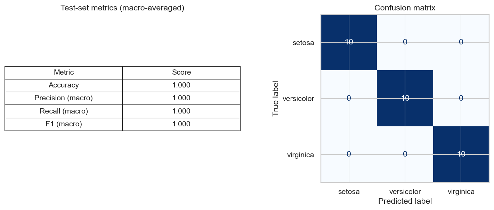

# W5A1 — SVM on the Iris Dataset (Linear Kernel)

A short Yoobee 803 exercise that loads, cleans and visualises the classic
**Iris** dataset from the UCI Machine Learning Repository, then trains and
evaluates a Support Vector Machine with a **linear** kernel.

Dataset: <https://archive.ics.uci.edu/dataset/53/iris>

## Repository layout

```
W5A1_SVM_Iris/
├── README.md                # this file
├── requirements.txt         # Python dependencies
├── svm_iris.ipynb           # executed notebook (load → clean → visualise → train → test)
├── iris.data                # raw UCI data (150 rows, no header)
├── iris.names               # UCI metadata / column descriptions
└── figures/
    ├── 01_class_distribution.png
    ├── 02_pairplot.png
    ├── 03_correlation_heatmap.png
    ├── 04_confusion_matrix.png
    ├── metrics_summary.csv
    └── results.png          # screenshot used below
```

## How to reproduce

```bash
python3 -m pip install -r requirements.txt
jupyter nbconvert --to notebook --execute svm_iris.ipynb --output svm_iris.ipynb
```

## Pipeline

1. **Load** — read `iris.data` with `pandas`, attaching the four feature
   columns plus the `class` target from `iris.names`.
2. **Clean** — check `dtypes` / missing values, drop the three exact-duplicate
   rows, and strip the `Iris-` prefix from class labels for nicer plots.
3. **Visualise** — class-balance bar chart, Seaborn pair plot coloured by
   species, and a feature-correlation heatmap.
4. **Split & scale** — stratified 80 / 20 train / test split
   (`random_state=42`) and `StandardScaler` fit on the training fold only.
5. **Train** — `SVC(kernel='linear', C=1.0)`.
6. **Evaluate** — accuracy, macro precision / recall / F1, full classification
   report and confusion matrix on the held-out test set.

## Test-set results

| Metric              | Score |
| ------------------- | ----- |
| Accuracy            | 1.000 |
| Precision (macro)   | 1.000 |
| Recall (macro)      | 1.000 |
| F1 (macro)          | 1.000 |

Per-class classification report (test set, 30 samples, 10 per class):

```
                 precision    recall  f1-score   support
        setosa     1.000      1.000     1.000       10
    versicolor     1.000      1.000     1.000       10
     virginica     1.000      1.000     1.000       10
      accuracy                          1.000       30
     macro avg     1.000      1.000     1.000       30
  weighted avg     1.000      1.000     1.000       30
```

### Screenshot



The linear kernel is enough to separate the three Iris species on this split —
`setosa` is linearly separable from the other two, and `versicolor` /
`virginica` overlap only narrowly along petal length / width, which a linear
boundary handles after standardisation.
